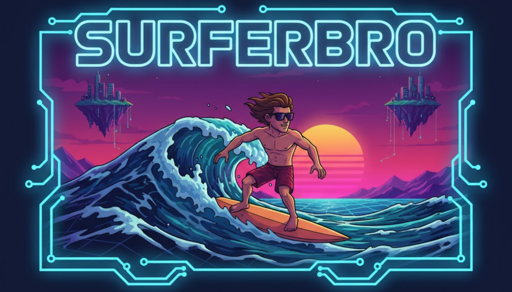

<div align="center">
  

  # SurferBro - Reinforcement Learning Surfing Simulator

  An advanced reinforcement learning environment where an AI agent learns to surf from complete noob to pro surfer through realistic wave physics and precise surfing mechanics.

  [](https://www.python.org/downloads/)
  [](https://opensource.org/licenses/MIT)
  [](https://gymnasium.farama.org/)
</div>

---

## ✨ Features

### Realistic Wave Physics
- **Angled Wave Fronts**: Waves arrive at ±30° angles (not straight on)
- **3-Phase Lifecycle**: Building (2s) → Front (3s rideable) → Whitewash (5s decay)
- **Variable Dynamics**: Wave size affects carry duration (1-3 seconds)
- **Auto-Detection**: Automatically detects beach location and sets wave direction

### Precise Surfing Mechanics
- **45° Catch Angle**: Must paddle at 45° to wave front (±5° tolerance)
- **Duck Diving**: 3-second underwater phase provides wave immunity
- **Crash → Whitewash Carry**: Realistic wipeout mechanics (doesn't end episode!)
- **Strategic Gameplay**: Use whitewash carry to return to lineup faster

### Optimized for RL Training
- **750-step episodes** (~25 seconds) for faster learning iterations
- **Shaped rewards** for forward movement, duck diving, escaping whitewash
- **18-value observation space** with all surfer state flags
- **7-action space** for swimming, duck diving, board control, and surfing

---

## 🚀 Quick Start

### Installation

```bash
# Clone the repository
git clone https://github.com/yourusername/SurferBro.git
cd SurferBro

# Install dependencies
pip install -r requirements.txt

# Install package in development mode
pip install -e .
```

### Verify Installation

```bash
python scripts/verify_installation.py
```

### Start Training

```bash
# Full production training (1M steps, ~12-15 hours)
python train_surferbro.py

# Monitor with TensorBoard
tensorboard --logdir ./logs/
```

**Quick Test** (10 minutes):
```bash
python -c "
from surferbro.environments.surf_env import SurfEnvironment
from stable_baselines3 import SAC
env = SurfEnvironment()
model = SAC('MlpPolicy', env, verbose=1)
model.learn(total_timesteps=50_000, progress_bar=True)
model.save('surferbro_quick_test')
"
```

---

## 📖 Documentation

Comprehensive documentation in the `docs/` directory:

- **[Training Guide](docs/TRAINING_GUIDE.md)** - Training options, monitoring, hyperparameter tuning
- **[Implementation Summary](docs/FINAL_IMPLEMENTATION_SUMMARY.md)** - Technical details and test results
- **[Proposed Mechanics](docs/PROPOSED_REALISTIC_MECHANICS.md)** - Future features (Wave Sets, Stamina, etc.)
- **[Getting Started](docs/GETTING_STARTED.md)** - Detailed usage guide
- **[Project Overview](docs/PROJECT_OVERVIEW.md)** - High-level architecture

---

## 🎯 How Surfing Works

### The Complete Surfing Sequence

1. **🏊 Swim** - Paddle north toward the wave zone
2. **🌊 Duck Dive** - When wave approaches, dive underwater (3s) to avoid pushback
3. **📐 Position** - Align at 45° to wave front (±5° tolerance - very precise!)
4. **🚣 Paddle** - Match wave speed to catch the wave
5. **⏱️ Get Carried** - Wave carries you for 1-3 seconds (depends on wave size)
6. **🧍 Stand Up** - Stand when aligned with wave direction
7. **🏄 Surf!** - Ride the wave with balance control
8. **💥 Crash?** - Whitewash carries you back → Duck dive to escape!

### Strategic Elements

**Crashes ≠ Failure**: Getting carried by whitewash can be used strategically to return to the lineup faster than swimming! The agent must learn when to:
- Intentionally bail to get back quickly
- Time duck dives to escape whitewash at the right moment
- Balance risk vs reward of wave attempts

---

## 🎓 Expected Learning Timeline

Training a competent surfer takes significant experience:

| Steps | Expected Behavior | Reward Range |
|-------|-------------------|--------------|
| **0-50k** | Random exploration, occasional forward movement | -100 to -50 |
| **50k-100k** | Learns to swim north, duck diving appears | -50 to -20 |
| **100k-250k** | Duck dive mastery, whitewash escapes | -20 to 0 |
| **250k-500k** | Wave catching attempts, angle positioning | 0 to +20 |
| **500k-1M** | Consistent surfing, strategic behavior | +20 to +50 |
| **1M+** | Mastery: wave selection, optimal timing | +50 to +100+ |

**Recommendation:** Train for at least 1 million steps to see full behavior emergence.

---

## 📁 Project Structure

```
SurferBro/
├── surferbro/              # Main package
│   ├── environments/       # Gymnasium environment (surf_env.py, surfer.py)
│   ├── physics/           # Wave simulation (wave_simulator.py, ocean_floor.py)
│   └── visualization/     # Pygame renderer (renderer_fixed.py)
├── docs/                  # Documentation
│   ├── TRAINING_GUIDE.md
│   ├── FINAL_IMPLEMENTATION_SUMMARY.md
│   └── PROPOSED_REALISTIC_MECHANICS.md
├── scripts/               # Utility scripts
│   ├── test_all_new_mechanics.py
│   ├── test_duck_dive_escape.py
│   └── verify_installation.py
├── models/               # Trained models (created during training)
├── checkpoints/          # Training checkpoints (created during training)
├── logs/                 # TensorBoard logs (created during training)
├── config.yaml          # Environment configuration
├── train_surferbro.py   # Main production training script
└── README.md           # This file
```

---

## 🔧 Configuration

Edit `config.yaml` to customize the environment:

```yaml
waves:
  period: 3.0              # Wave spawn interval (seconds)
  base_height: 1.5         # Average wave height (meters)
  direction: 270.0         # Base wave direction (degrees)
  randomness: 0.2          # Wave variation factor
  breaking_depth_ratio: 1.3
  whitewash_duration: 5.0

simulation:
  timestep: 0.01           # Physics timestep (seconds)
  max_episode_steps: 750   # Episode length (~25 seconds)
  render_fps: 30

rewards:
  wave_catch_success: 50.0
  surfing_per_second: 10.0
  duck_dive_success: 5.0
  fall_penalty: -20.0
  time_penalty: -0.1
```

---

## 🧪 Testing

Comprehensive test suite to verify all mechanics:

```bash
# Test all mechanics (waves, crash carry, duck dive, rewards, etc.)
python scripts/test_all_new_mechanics.py

# Test specific mechanic
python scripts/test_duck_dive_escape.py
```

**Expected output:** All tests passing (100%)

---

## 🚧 Future Enhancements

See [Proposed Mechanics](docs/PROPOSED_REALISTIC_MECHANICS.md) for detailed implementation plans:

### High Priority (Max Realism)
- **Wave Sets** - 3-7 waves arrive in sets with 20-40s lull periods
- **Paddling Stamina** - Energy management (depletes while paddling, regens while resting)
- **Peak Positioning** - Waves break from a peak (peak = harder/powerful, shoulder = easier)
- **Rip Currents** - Environmental challenge that pushes surfer sideways

### Medium Priority (Strategic Depth)
- Wave Closeouts (15% of waves unrideable)
- Impact Zone vs Channel navigation
- Turning/Maneuvering while surfing
- Wave Quality Variance

### Polish
- Board Selection (shortboard vs longboard)
- Wind Effects (offshore/onshore)
- Tide Changes
- Barrel Riding (advanced)

---

## 📊 Training Script Features

`train_surferbro.py` provides production-ready training:

✅ **Automatic checkpoints** every 50k steps
✅ **Evaluation** every 10k steps
✅ **Best model saving** (highest reward)
✅ **TensorBoard logging** (live graphs)
✅ **Custom metrics** (surf time, crashes, escapes)
✅ **Progress bar** with ETA
✅ **Resumable** from checkpoints

---

## 🤝 Contributing

Contributions welcome! See [CONTRIBUTING.md](CONTRIBUTING.md) for guidelines.

Areas where help is appreciated:
- Implementing proposed mechanics (Wave Sets, Stamina, etc.)
- Hyperparameter tuning for faster learning
- Additional test coverage
- Documentation improvements

---

## 📜 License

MIT License - See [LICENSE](LICENSE) file for details.

---

## 🎓 Technical Details

### Reinforcement Learning

- **Environment**: Gymnasium-compatible (continuous action/observation spaces)
- **Algorithm**: SAC (Soft Actor-Critic) - recommended for continuous control
- **Observation Space**: 29 dimensions (surfer state + wave info + jellyfish + env)
- **Action Space**: 7 dimensions (swimming, duck diving, board control, surfing)

### Physics Simulation

- **Wave System**: Angled fronts with perpendicular geometry
- **Surfer Physics**: Mass-based dynamics with buoyancy, drag, gravity
- **Duck Dive**: 3-second underwater phase with collision immunity
- **Whitewash**: Post-crash carry mechanic with escape capability

### State Machine

```
SWIMMING → DUCK DIVING (3s) → SWIMMING
    ↓
BEING CARRIED (1-3s) → {SURFING, WHITEWASH CARRY (crash)}
    ↓                        ↓
SURFING → WHITEWASH CARRY → DUCK DIVING → SWIMMING
```

---

<div align="center">

## 🏄 Ready to Train an AI Surfer?

```bash
python train_surferbro.py
```

**Expected training time:** 12-15 hours for 1M steps
**Expected outcome:** Agent that can swim, duck dive, position, catch waves, and surf!

</div>

---

## Citation

If you use SurferBro in your research, please cite:
```
@software{surferbro2025,
  title={SurferBro: Reinforcement Learning Surfing Simulator},
  year={2025},
  note={Realistic surfing mechanics with angled waves, duck diving, and strategic gameplay}
}
```
